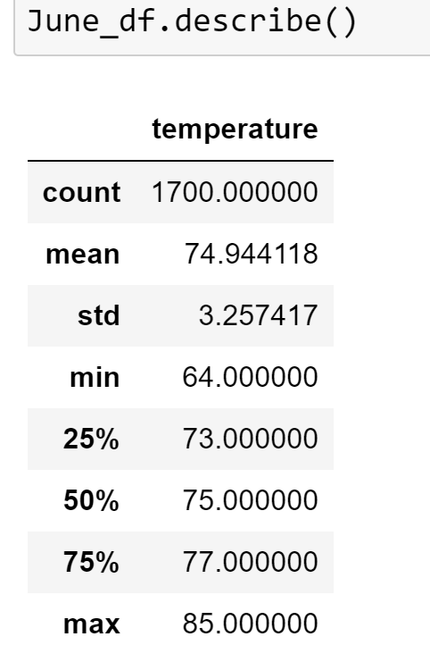
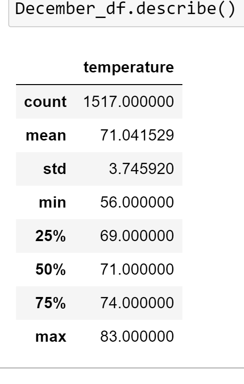

# Surfs_up
Run a Weather Analysis for Oahu using jupityer notebook, SQLite, and Flask

## Overview of the analysis

In this project we were tasked in pulling data from SQLite database. We have tables of weather information of Hawaii and based on the table we are creating a query to see the average temperature in specific months. We want to see the average temperature can affect the success of the surf an ice cream shop year-round. In this challenge we used sqlalchemy, SQLite, and Pandas to create summary statistics for the month of December and June.
## Results: 

-	The first month that we analyzed shows that the month June the temperature average was 74.9 degrees. Also, the minimum did not fall below 64 degrees.

-	The second month that we analyzed was December. December had a high temperature average at 71 degrees. The minimum was couple degrees cooler than June at 56 degrees.

-	The two months show that the temperature is on the higher end between 71 – 74.9 degrees. Also, we see that most of the temperatures for both months are going to fall between 69 – 74 degrees base upon the first and third quartiles. 

## Summary
The summary statistics show that during both months where the temperature would potentially vary, they seem to land around the same temperature range. The temperature looks like it will not vary between the months and the surf and ice cream shop will not be affected by the temperature. One additional query that can be done is a precipitation query. We know the temperature does not change, but if there is a record of more precipitation one month of the other this may influence sales because not many people will be out. Also, we can look to see if the months have more cold days then warm. To do a count on if the temperature reaches over a certain temperature allows us to see if that if the months will be more slow than other months. It will also let us see if June and December have similar number of days where it is colder than others. With this we can assume that the sales numbers may mirror each other.
